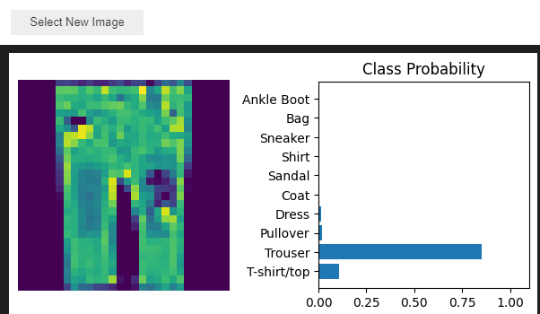
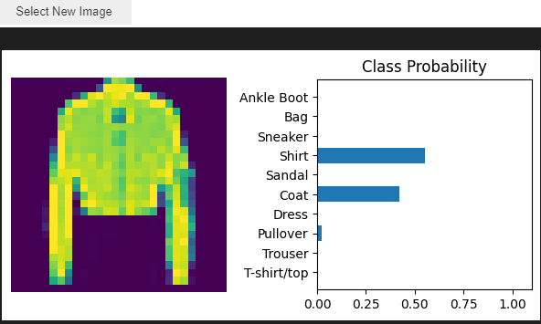

# Deeplearning_objects
## Toinen pieni syväoppimisprojekti, neuroverkko tunnistaa kuvassa olevan esineen

### train_model()
- Kouluttaa mallin

#### parametrit:
    - model: neuroverkkomalli
    - criterion: loss funktio
    - optimizer: optimisointi algoritmi
    - trainloader: DataLoader (MNIST)
    - epochs: Koulutuskierrosten määrä (vakio: 5).

#### palauttaa:
    - listan menetyksien keskiarvoista koulutuskierrosta kohden